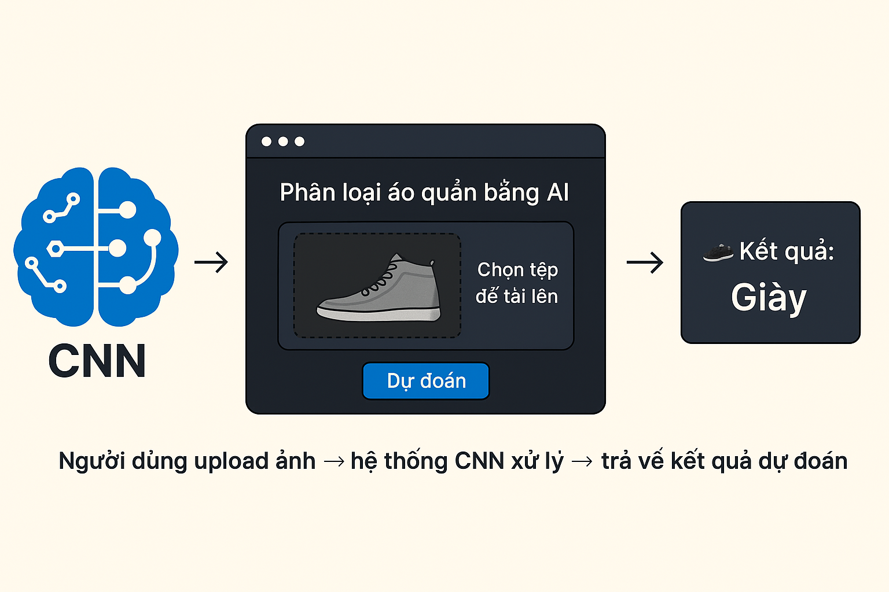

# 🔍 AI Phân Loại Sản Phẩm Thời Trang

Một ứng dụng web sử dụng **Deep Learning (CNN)** để phân loại sản phẩm quần áo dựa trên ảnh đầu vào. Người dùng chỉ cần upload ảnh quần áo, hệ thống sẽ dự đoán loại sản phẩm đó là gì.

## 📷 Demo Giao Diện



## 🌟 Tính năng nổi bật

- ✅ Dự đoán sản phẩm thời trang bằng AI (CNN model)
- 🌙 Giao diện đẹp + Dark mode
- 🌍 Hỗ trợ đa ngôn ngữ: 🇻🇳 Tiếng Việt, 🇯🇵 日本語, 🇺🇸 English
- 🖼️ Xử lý ảnh upload, resize và dự đoán real-time

## 🧠 Công nghệ sử dụng

- Python 3.10
- TensorFlow / Keras
- Flask
- HTML, Bootstrap, CSS (custom dark mode)
- Jinja2 template

## 🚀 Cách sử dụng

1. Clone dự án:
   ```bash
   git clone https://github.com/tringuyenminh209/du_doan_quan_ao_ai.git
   cd du_doan_quan_ao_ai
